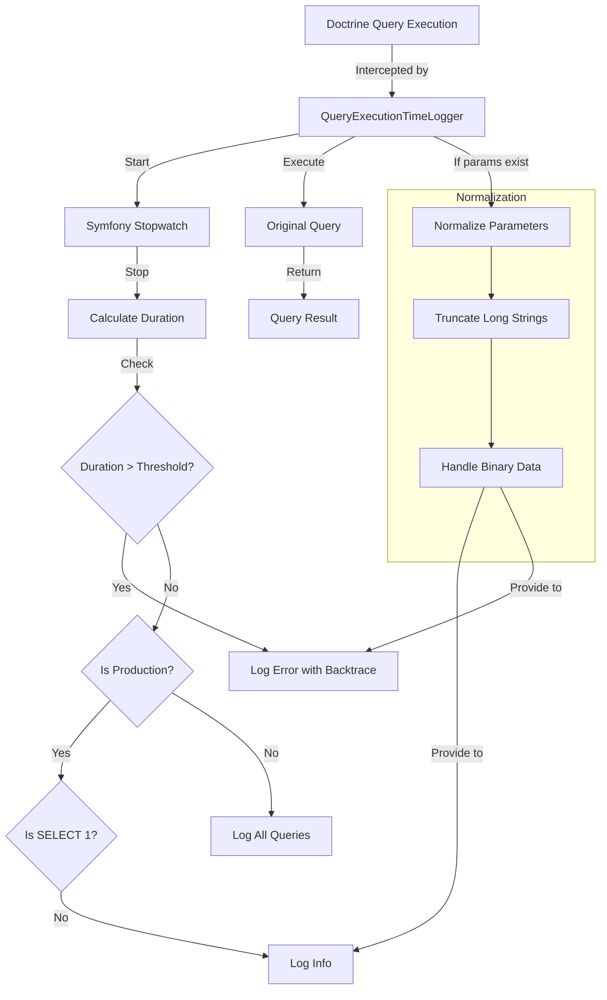
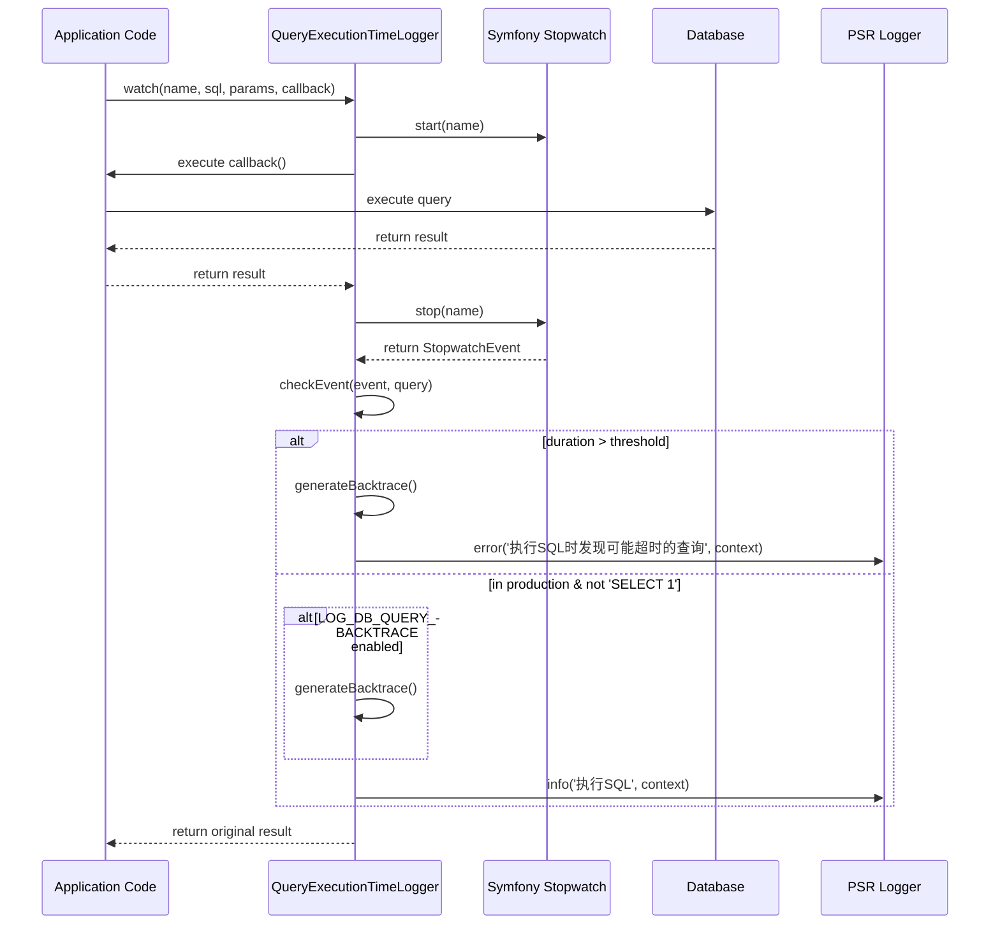
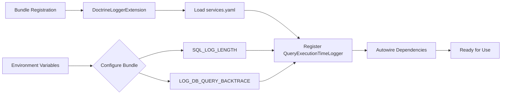

# Doctrine Logger Bundle Workflow

This document describes the workflow and data flow of the Doctrine Logger Bundle.

## Query Execution Monitoring Workflow

## Component Interaction

## Configuration Flow

This workflow documentation illustrates how the Doctrine Logger Bundle intercepts database queries, measures their execution time, and logs appropriate information based on configuration and execution context.
